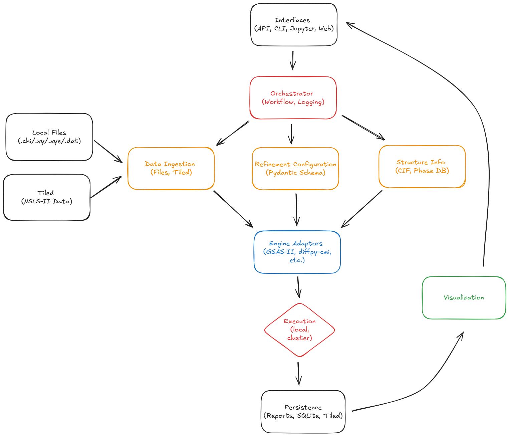

# 🧙‍♂️ RoboMage
### Automated Powder Diffraction Analysis Framework for NSLS-II Beamlines

---

## 🔭 Project Overview

**RoboMage** is a modular Python framework for **automated powder diffraction analysis and Rietveld refinement** across NSLS-II beamlines.
It provides a flexible, AI-ready architecture for performing, monitoring, and reproducing diffraction refinements with minimal manual effort.

The project’s initial focus is to integrate **GSAS-II** into an automated pipeline, with extendability toward **diffpy-CMI**, **TOPAS**, and other refinement engines.

Over the next year, RoboMage will evolve into a cross-beamline platform supporting automated data ingestion, configuration generation, refinement execution, and persistent archiving of results.

---

## 🎯 Project Goals

- **Automation:** Enable beamline scientists and users to launch and monitor Rietveld refinements with minimal manual input.
- **Reproducibility:** Guarantee that refinements are fully traceable, with all parameters, metadata, and provenance stored in a structured database.
- **Scalability:** Support multiple beamlines (starting with PDF and XPD) and multiple refinement engines via modular adapters.
- **Extensibility:** Provide clear interfaces so that new analysis methods, ML components, or GUIs can be added without changing the core code.
- **Usability:** Offer both Python and GUI access — notebook, CLI, or eventual web interface — for interactive or automated operation.

---

## ⚙️ Architecture Overview

RoboMage is designed as a collection of connected modules that exchange structured JSON-based configuration and results.
Each module can operate independently or be orchestrated in an automated workflow.

| Layer | Description |
|-------|--------------|
| **Interfaces** | CLI, Jupyter notebooks, REST or web GUI (future). Entry points for users to submit refinement jobs. |
| **Orchestrator** | Core controller managing workflow, logging, and coordination between modules. |
| **Data Ingestion** | Reads experimental data from local files or streaming sources (Tiled, Databroker). |
| **Refinement Config** | Pydantic schema defining parameters for refinements, ensuring validation and reproducibility. |
| **Structure Info** | Retrieves crystallographic data (CIFs, structure databases) for phases to refine. |
| **Engine Adapters** | Abstract layer translating JSON configs into commands for GSAS-II, diffpy-CMI, or other tools. |
| **Storage & Visualization** | Persists all inputs, outputs, and metadata in a database; provides plotting and comparison utilities. |

A feedback (provenance) loop allows past results to inform future refinements and potential AI-guided optimization.




---

## 🧩 Core Technologies

| Category | Tools / Libraries |
|-----------|-------------------|
| Environment & Packaging | **Pixi** (conda-forge based) |
| Configuration & Validation | **Pydantic v2** |
| Refinement Engines | **GSAS-II**, **diffpy-CMI** (planned) |
| Data Access | **Tiled**, **Databroker** |
| Storage | **SQLite → PostgreSQL** |
| Visualization | **Matplotlib**, **Pandas** |
| Testing | **pytest** |
| Linting & Formatting | **Ruff**, **mypy** |
| CI | **GitHub Actions** |
| Docs | **Markdown** / **Sphinx** (future) |

---

## 🧱 Repository Layout

```
RoboMage/
├── src/robomage/
│   ├── config/               # Pydantic schemas (RefinementConfig, etc.)
│   ├── engines/              # Adapters for GSAS-II, diffpy-CMI
│   ├── data/                 # Ingestion and metadata utilities
│   ├── orchestrator.py       # Workflow coordination
│   ├── storage.py            # Persistence layer
│   └── visualization.py      # Plotting and reporting
├── tests/                    # pytest-based unit tests
├── docs/                     # documentation and architecture figure
├── pixi.toml                 # reproducible environment
├── pyproject.toml            # package metadata
└── .github/workflows/        # CI definitions
```

---

## 🚀 Quick Start Guide

RoboMage is built for reproducible environments using **Pixi**.  
Follow these steps to get started on Windows PowerShell:

```powershell
# Clone the repository
git clone https://github.com/<your-username>/RoboMage.git
cd RoboMage

# Install dependencies via Pixi
pixi install

# Run tests to verify installation
pixi run test

# Format code (optional)
pixi run format

# Run Ruff lint and type checks
pixi run lint
pixi run typecheck
```

Open in VS Code to start development:
```powershell
code .
```

> 🧠 Tip: If Ruff or mypy aren’t running automatically in VS Code,  
> check that the Python interpreter path points to `.pixi/envs/default/python.exe`  
> (in **.vscode/settings.json**).

---


## 🧪 Current Status (Sprint 4, Phase 1.5)

- ✅ **Dash-based dashboard** with 3-tab interface (Data Import, Visualization, Analysis)
- ✅ **Wavelength management system** (per-file, default 0.1665 Å synchrotron)
- ✅ **Robust file upload and removal** (red 'X' button for file removal)
- ✅ **Accurate Q→2θ conversion** using file-specific wavelength
- ✅ **Publication-quality plotting** (line, scatter, filled area)
- ✅ **State management** with dcc.Store for inter-tab communication
- ✅ **All tests passing and scientific validation**

**Ready for Phase 2:** Analysis tab and service integration framework in place.

---

## 🧭 Next Steps (Weeks 2–4)

- Implement `DataIngestion` module with Tiled and file readers.
- Integrate GSAS-II API for initial automated refinement loop.
- Extend schema to include multiple phase refinements and constraints.
- Establish persistent results database (SQLite).
- Begin pilot deployment on the PDF and XPD beamlines.

---

## 🧠 Vision

RoboMage will ultimately act as a **smart, autonomous assistant** for powder diffraction workflows:
ingesting data, generating refinement models, executing fits, validating results, and learning from prior experiments to improve efficiency and insight.

---

## 🤝 Acknowledgments

This project is developed at **Brookhaven National Laboratory (BNL)** under the **NSLS-II** program.
It builds on community software from the **NSLS-II Data Acquisition and Management (DAMA)** team, **Bluesky**, and **Scientific Python** ecosystem.
