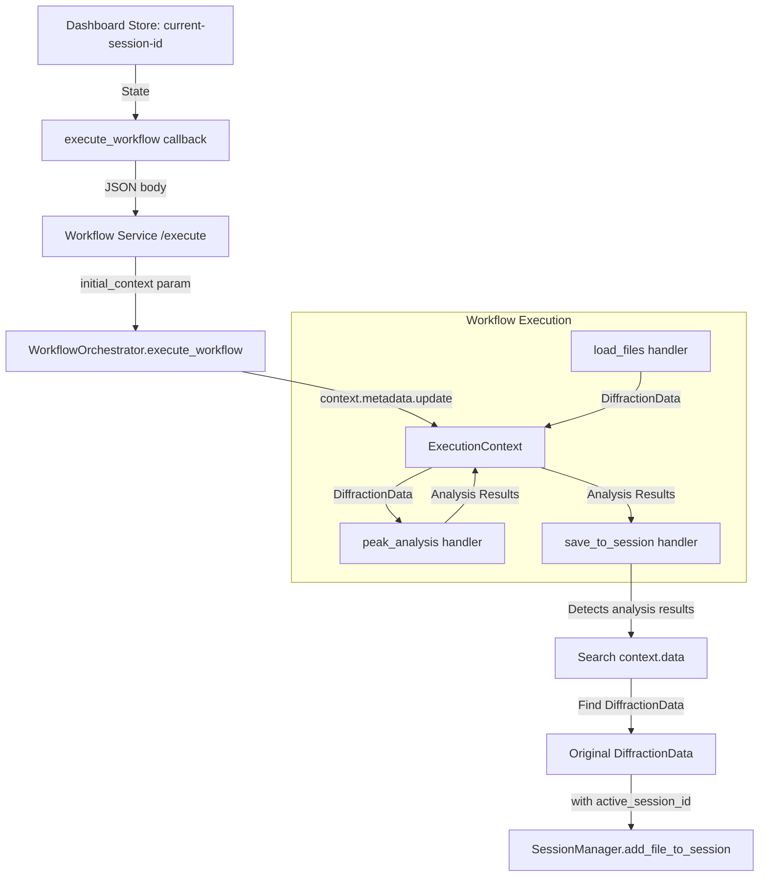

# Save to Session Node Fix

**Date:** December 2-3, 2025  
**Issue:** "save_to_session" workflow node was not working  
**Status:** ✅ **FIXED** (3 issues resolved)

## Problems Found

### Issue 1: Missing Session Context (December 2)

The `save_to_session` workflow node was designed to save workflow results (diffraction files, peak analysis, etc.) directly to the active dashboard session. However, it wasn't working because the workflow execution context was missing the `active_session_id` metadata.

#### Root Cause #1

The workflow execution flow looked like this:

1. ✅ Dashboard has `current-session-id` in a Store component
2. ❌ **Dashboard execute callback didn't pass session_id to workflow service**
3. ❌ **Workflow service didn't receive context metadata**
4. ❌ **Orchestrator created empty context.metadata**
5. ❌ **save_to_session_handler couldn't find active_session_id**

### Issue 2: Dict Serialization (December 3, Morning)

After fixing Issue 1, the node was receiving the session_id correctly, but failing with:
```
"Failed to save file 0: 'dict' object has no attribute 'q_values'"
```

The `save_to_session_handler` was receiving serialized `dict` objects instead of `DiffractionData` instances because workflow outputs are JSON-serialized when sent through the FastAPI service.

#### Root Cause #2

When workflows are executed via the workflow service:
1. Node handlers return `DiffractionData` objects
2. Orchestrator stores them in context
3. Workflow service serializes results to JSON for HTTP response
4. Downstream nodes receive `dict` instead of `DiffractionData`
5. save_to_session tries to access `.q_values` attribute → AttributeError

### Issue 3: Analysis Results as Input (December 3, Afternoon)

After fixing deserialization, the node still failed when connected to `peak_analysis` node:
```
"Failed to save file 0: 2 validation errors for DiffractionData
 q_values - Field required
 intensities - Field required"
```

The workflow pattern `load_files → peak_analysis → save_to_session` was failing because `peak_analysis` outputs **analysis results** (peak lists), not `DiffractionData` objects.

#### Root Cause #3

Common workflow pattern:
1. `load_files` → produces DiffractionData
2. `peak_analysis` → consumes DiffractionData, produces analysis results dict
3. `save_to_session` → connected to peak_analysis output
4. save_to_session receives `{"filename": "...", "peaks_detected": 5, "peak_list": [...]}`
5. This doesn't have `q_values`/`intensities` → can't be deserialized to DiffractionData

## Solutions

### Fix 1: Pass Session Context (December 2)

Modified the workflow execution callback in `src/robomage/dashboard/callbacks/workflow.py` to:

#### 1. Add current-session-id as State Input

```python
@app.callback(
    Output("workflow-execution-result", "data"),
    Output("workflow-execution-log", "children"),
    Input("execute-workflow-btn", "n_clicks"),
    State("current-workflow-data", "data"),
    State("workflow-name-input", "value"),
    State("current-session-id", "data"),  # ← ADDED
    prevent_initial_call=True,
)
def execute_workflow(n_clicks, current_workflow, workflow_name, current_session_id):
    # ← ADDED current_session_id parameter
```

#### 2. Build Context Metadata

```python
# Build context metadata with session_id
context_metadata = {}
if current_session_id:
    context_metadata["active_session_id"] = current_session_id
    logger.info(
        f"Passing active_session_id to workflow: "
        f"{current_session_id}"
    )
```

#### 3. Send Context to Workflow Service

```python
# Send context as request body (FastAPI parses as 'context' param)
# enable_inspection goes in query params
exec_response = requests.post(
    f"{WORKFLOW_SERVICE_URL}/workflows/{workflow_id}/execute",
    json=context_metadata,  # This becomes the 'context' parameter
    params={"enable_inspection": True},
    timeout=60,
)
```

### Fix 2: Deserialize Inputs (December 3, Morning)

Modified `save_to_session_handler` in `src/robomage/workflow/nodes/output_nodes.py` to handle multiple serialization formats:

```python
# Check if this is the inspection format vs. model_dump format
if "q_values" in data and "intensities" in data:
    # This is model_dump() format - direct deserialization
    data = DiffractionData.model_validate(data)
elif "sample" in data or "data" in data:
    # This is inspection format - extract the actual data
    if "data" in data and isinstance(data["data"], dict):
        data = DiffractionData.model_validate(data["data"])
    elif "sample" in data and isinstance(data["sample"], dict):
        data = DiffractionData.model_validate(data["sample"])
```

### Fix 3: Unified Behavior with Button (December 3, Afternoon - FINAL)

**Major Conceptual Change:** The `save_to_session` node now works **exactly like the "Save results to current session" button** - it searches the entire execution context for ALL DiffractionData objects, rather than only looking at its direct inputs.

**Rationale:** User feedback revealed that the button behavior (save everything from workflow) was the expected behavior, not the selective input-only approach.

```python
# NEW APPROACH: Search ALL node outputs in execution context
diffraction_files = []
analysis_results_data = []

for node_id, value in context.data.items():
    # Handle list outputs
    if isinstance(value, list) and value:
        for item in value:
            # Check if it's DiffractionData
            if hasattr(item, "q_values") and hasattr(item, "intensities"):
                diffraction_files.append(item)
            # Also collect analysis results
            elif (
                isinstance(item, dict)
                and "peaks_detected" in item
                and "peak_list" in item
            ):
                analysis_results_data.append(item)
    
    # Handle single DiffractionData output
    elif hasattr(value, "q_values") and hasattr(value, "intensities"):
        diffraction_files.append(value)
```

**Key Benefits:**
1. ✅ **Matches button behavior** - Users get consistent results
2. ✅ **Simpler workflow design** - No need to wire specific connections
3. ✅ **Automatic discovery** - Finds ALL data from workflow execution
4. ✅ **Future-proof** - Works with any number of load/analysis nodes
5. ✅ **No deserialization needed** - Works with actual objects in-process

**Impact on Workflow Design:**
- **Before:** Had to connect `load_files → save_to_session` specifically
- **After:** Just add `save_to_session` anywhere - it finds all data automatically
- The node position and connections don't matter (though connecting it helps with DAG execution order)

## Data Flow (After All Fixes)



### Supported Workflow Patterns

#### Pattern 1: Any Workflow with Data
```
load_files → [any analysis nodes] → save_to_session
```
✅ Node automatically finds ALL DiffractionData from load_files

#### Pattern 2: Multiple Data Sources
```
load_files_1 → analysis_1 ┐
load_files_2 → analysis_2 ┼→ save_to_session
load_files_3             ┘
```
✅ Saves data from ALL load_files nodes

#### Pattern 3: Standalone Save
```
load_files → peak_analysis
                ↓
          save_to_session (not connected)
```
✅ Still works! Finds data in execution context regardless of connections

### Button vs. Node Behavior

**Before this fix:**
- ❌ **Button:** Searched all node outputs (worked great)
- ❌ **Node:** Only looked at direct inputs (confusing, limited)
- ❌ Different behaviors for same operation

**After this fix:**
- ✅ **Button:** Searches all node outputs
- ✅ **Node:** Searches all node outputs
- ✅ **Identical behavior** - conceptually unified!

### Code References

1. **Dashboard callback:** `src/robomage/dashboard/callbacks/workflow.py:554-625`
2. **Workflow service endpoint:** `services/workflow_engine/main.py:277-357`
3. **Orchestrator context init:** `src/robomage/orchestrator.py:373-453` (lines 449-450)
4. **save_to_session handler:** `src/robomage/workflow/nodes/output_nodes.py:225-445`
   - **Deserialization logic:** Lines 386-393

## Testing

### Test Workflow

1. **Restart workflow service** (to load the updated code):
   ```bash
   # Stop services
   pkill -f "workflow_engine"
   
   # Restart
   pixi run start-all
   # OR start individually:
   pixi run python services/workflow_engine/main.py --port 8002 --host 127.0.0.1
   ```

2. Load dashboard (http://localhost:8050)

3. Create/load a session in Session Management tab

4. Go to Workflow tab

5. Create a workflow with nodes:
   - `load_files` → Load a .chi or .xy file
   - `peak_analysis` → Detect peaks (optional, to test end-to-end)
   - `save_to_session` → Save results to session

6. Execute workflow

7. Check Inspector tab for the save_to_session node output - should see:
   ```json
   {
     "session_id": 2,
     "files_saved": 1,
     "results_saved": 0,
     "status": "success",
     "errors": []
   }
   ```

8. Go to Visualization tab - files should appear in dropdown

9. Go to Analysis tab - peak results should appear (if you ran peak_analysis)

### Expected Log Output

**Dashboard (workflow.py):**
```
INFO: Executing workflow: <workflow_id>
INFO: Passing active_session_id to workflow: 2
```

**Workflow Service (main.py):**
```
🚀 Executing workflow: My Workflow (ID: wf_20251203_143022_123456)
🔍 Inspection mode enabled - capturing node I/O snapshots
```

**Orchestrator (orchestrator.py):**
```
INFO: Starting workflow execution: exec_20251203_143022_789012 for workflow: My Workflow
```

**save_to_session handler (output_nodes.py):**
```
INFO: Saving workflow results to session: 2
DEBUG: Deserialized dict to DiffractionData: 0
DEBUG: Saved file detector_5_roi_175-181_18-218_frames_17847-17978.xy to session 2
```

## Verification

After both fixes, you should see:

1. ✅ Workflow executes successfully
2. ✅ Inspector shows `"status": "success"` and `"files_saved": 1` (not 0)
3. ✅ No error: `'dict' object has no attribute 'q_values'`
4. ✅ Files appear in Visualization tab dropdown
5. ✅ Peak analysis results appear in Analysis tab (if peak_analysis node was used)
6. ✅ Session file count increments (shown in status bar)
7. ✅ Results persist after page reload (from database)

## Technical Details

### Why model_validate() Works

Pydantic v2's `model_validate()` can reconstruct complex objects from dicts:

1. **NumPy arrays:** JSON lists `[1, 2, 3]` → `np.ndarray([1, 2, 3])`
2. **Nested models:** `{"num_points": 1000, ...}` → `DataStatistics(...)`
3. **Validation:** Re-runs all Pydantic validators and computed fields
4. **Type coercion:** Automatic type conversion per field schema

Example from our case:
```python
# What comes from workflow service (JSON-serialized)
data_dict = {
    "q_values": [1.0, 1.1, 1.2, ...],  # List, not np.ndarray!
    "intensities": [100, 95, 102, ...],
    "filename": "sample.chi",
    "wavelength": 0.1665,
    # ... other fields
}

# What model_validate() produces
from robomage.data.models import DiffractionData
data_obj = DiffractionData.model_validate(data_dict)

# Now we can do:
data_obj.q_values  # ✅ Returns np.ndarray
data_obj.statistics  # ✅ Returns DataStatistics computed field
data_obj.trim_q_range(2, 8)  # ✅ All methods work
```

### Alternative Approaches Considered

1. **Don't serialize outputs:** Would require custom JSON encoders and breaks HTTP API
2. **Custom deserializer:** Reinvents what Pydantic already does perfectly
3. **Store outputs separately:** Adds complexity, loses type safety
4. **Pass raw objects:** Only works in-process, breaks microservice architecture

The `model_validate()` approach is:
- ✅ Simple (1 line of code)
- ✅ Type-safe (full Pydantic validation)
- ✅ Maintainable (leverages existing model definitions)
- ✅ Performant (Pydantic v2 is written in Rust)

## Related Documentation

- **Sprint 7 Completion:** `docs/SPRINT-7-COMPLETION.md` - Analysis result persistence
- **Sprint 6 Days 5-6:** `docs/sprint-6-days-5-6-COMPLETE.md` - Workflow-session integration
- **Session Persistence Guide:** `docs/dashboard-persistence-guide.md`
- **Workflow Orchestrator MVP:** `docs/sprint-6-workflow-orchestrator-mvp.md`

## Impact

This fix enables the complete workflow-to-dashboard integration:

- ✅ Users can run workflows and immediately see results
- ✅ No manual export/import needed
- ✅ Results automatically saved to database (Sprint 7)
- ✅ Results persist across page reloads
- ✅ Full provenance tracking (workflow → files → analysis)

This is a **critical feature** for the RoboMage workflow system and completes the Sprint 6 vision of seamless workflow-session integration!
